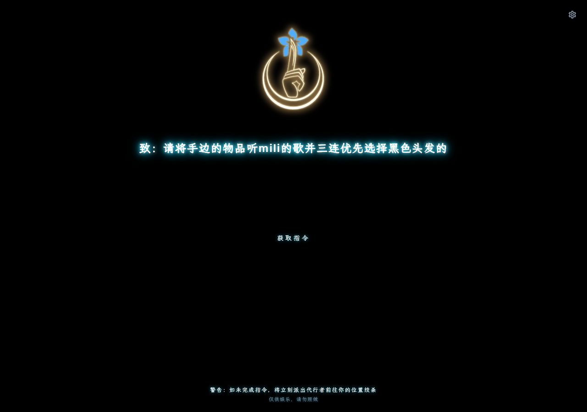

# 指令 · 食指指令生成器（Flutter 版）

[hhz-or/web-instruction](https://github.com/hhz-or/web-instruction) 的 Flutter 复刻。
按下按钮，随机生成一条 Project Moon「食指」阵营的指令，配霓虹乱码动画。

**以本地桌面运行为主要目标**，Web 是顺带的产物。



---

## 跑起来

```bash
git clone git@github.com:hhz-or/zl-flutter.git
cd zl-flutter
flutter pub get
flutter run -d windows            # 主要目标
flutter run -d chrome             # 顺带支持
```

发布构建：

```bash
flutter build windows --release
flutter build web --release --base-href / --no-web-resources-cdn
```

> 只有要**重新生成字体子集**时才需要原项目的参考副本：
> `git clone https://github.com/hhz-or/web-instruction 指令`（跑 `--verify` 不需要）。

---

## 特性

* **逐项对齐原版**：页面结构、样式数值、动画时序、抽取逻辑全部照 `index.html` +
  `main.css` + `script.js` 来；四组语料（130 句）逐字转录，未做删改。
* **乱码动画**：逐字锁定，长句 12 字/秒、短句 7.2 字/秒，排版全程零抖动，
  锁定前缀与真实文本**逐像素一致**。
* **流畅**：Windows/Impeller 上 raster p50 **3.8 ms**（修复前 59.6 ms），稳定 60 fps。
* **中 / English**：跟随系统，或手动指定。
* **体积小**：字体子集化后共 **775 KiB**（原始 28.9 MB）。
* **离线自持**：不引入任何第三方运行时脚本、无埋点、无 Cookie。

## 设置（右上角齿轮）

| 分组 | 项目 | 默认值 |
| --- | --- | --- |
| 外观 | 主题色（HSV 自由调节，一键恢复默认蓝） | `#00d2ff`（原版） |
| 外观 | 语言 | 跟随系统 |
| 外观 | 霓虹发光 0 ~ 100 % | `100 %`（原版三层 text-shadow） |
| 动效 | 减少动效 | 关 |
| 动效 | 动画速度 0.25× ~ 3.00× | `1.00×`（原版速度） |
| 生成 | 启用彩蛋 | 开 |
| 生成 | 彩蛋概率 0 ~ 100 % | `15 %`（原版数值） |
| 生成 | 抽取策略 | 纯随机（与原版一致），可切「洗牌袋」 |

**每一项的默认值都等于原版行为**——不动任何一项时，应用与原站逐像素一致。
「霓虹发光」同时是性能开关，卡顿时调低即可。

---

## 开发

```bash
flutter analyze                        # 0 issue
flutter test                           # 全部用例
flutter test --coverage                # 行覆盖率
python tools/subset_fonts.py --verify  # 字体覆盖率门禁
```

帧时间基准（改渲染相关代码前后各跑一次）：

```bash
flutter build windows --profile -t benchmark/frame_bench.dart
build/windows/x64/runner/Profile/flutter_zl.exe
```

给 AI 编码助手看的说明（架构、约定、已踩过的坑）在 [AGENT.md](AGENT.md)。

---

## 文档

| 文档 | 内容 |
| --- | --- |
| [AGENT.md](AGENT.md) | 面向编码助手的架构与约定 |
| [docs/FIDELITY.md](docs/FIDELITY.md) | 与原版逐项对照、性能剖析、字体流水线 |
| [docs/VERIFICATION-1TO1.md](docs/VERIFICATION-1TO1.md) | 复刻保真度的独立验证报告 |
| [docs/VERIFICATION-PERF.md](docs/VERIFICATION-PERF.md) | 性能修复的独立验证报告 |
| [THIRD_PARTY_NOTICES.md](THIRD_PARTY_NOTICES.md) | 字体与语料的出处与许可 |

---

## 许可

代码以 [MIT](LICENSE) 授权，Copyright (c) 2026 hhz-or。

字体（SIL OFL 1.1）、语料与 Project Moon 设定不在 MIT 覆盖范围内，
详见 [THIRD_PARTY_NOTICES.md](THIRD_PARTY_NOTICES.md)。

本应用是非商业同人二创，**仅供娱乐，请勿照做**。