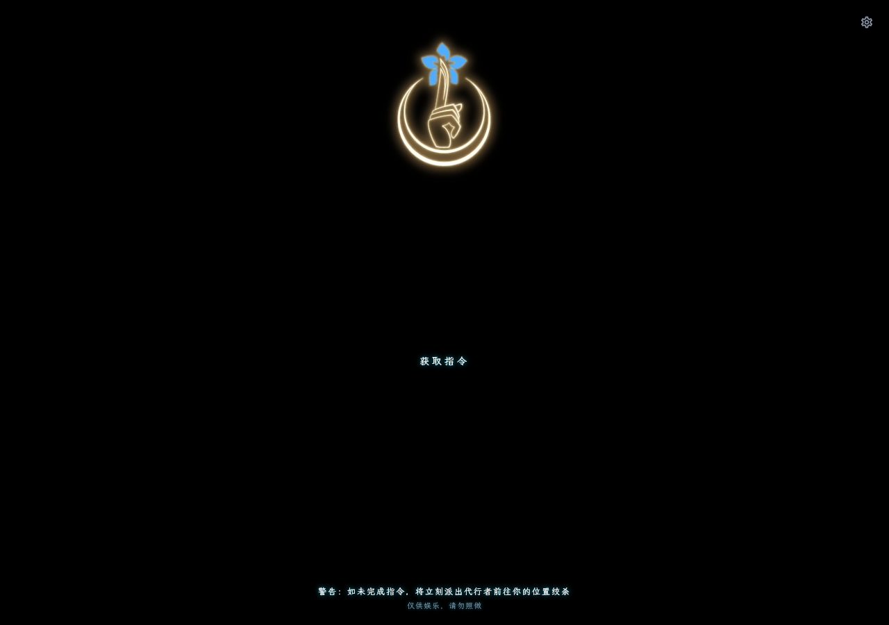
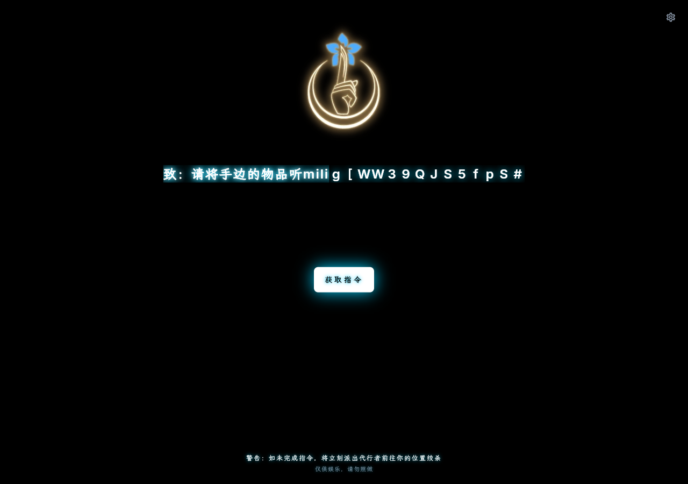
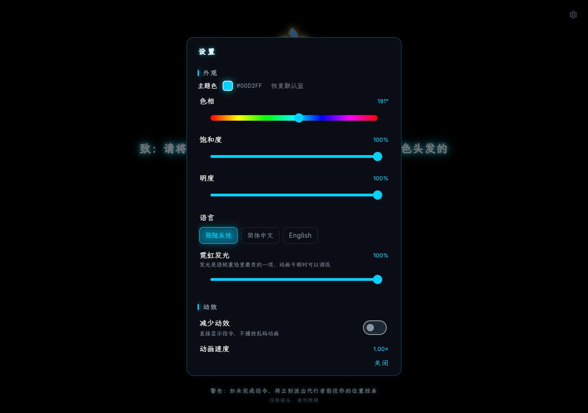

# 与原版的逐项对照 / 性能与字体细节

> 本文是 [README](../README.md) 的详细附录。README 只讲「是什么、怎么跑、有什么」；
> 「与原版到底哪里一致、哪里有意不同、性能怎么救回来的、字体怎么裁的」都在这里。
>
> 对照基线：原版 `index.html` + `main.css` + `script.js`，
> 体验站 <https://zl.hhz114514.qzz.io>，参考副本 `指令/`。

---

## 这是什么

按下按钮，随机生成一条来自 Project Moon《废墟图书馆》/《边狱公司》中**食指**阵营的指令，
配合逐字解码的乱码动画与霓虹发光文字呈现。

* 85 % 概率 **三段式拼装**：`场景限定句 + 核心行为句 + 补充要求句`（中间不加任何分隔符）
* 15 % 概率 **彩蛋**：自成因果的完整句子
* 正文前缀固定为 `致：`
* 语料共 **130 句**（场景 27 · 行为 62 · 补充 18 · 彩蛋 23），三段式理论组合数 **30 132 种**

> ⚠️ 语料逐字转录自原项目，包含荒诞、黑暗幽默乃至不适的内容。
> 这是原作设定的一部分，本复刻**未做任何删改**。全部内容均为虚构，请勿照做。

---

## 界面预览

截图由 `tools/capture_screenshots.mjs` 通过 Chrome DevTools Protocol 对真实 Web 产物自动截取
（Flutter 渲染在 `<canvas>` 上，无法用普通 DOM 自动化）。

| 初始状态（与原版一致：展示区为空） | 乱码动画进行中 | 动画结束 |
| --- | --- | --- |
|  |  |  |

| 设置（右上角齿轮，本应用唯一的新增界面） |
| --- |
|  |

---

---

## 性能：从 14 fps 到稳定 60 fps

第一版在 Windows 桌面（Impeller）上**肉眼可见地卡顿**。用 `benchmark/frame_bench.dart`
（`flutter build windows --profile -t benchmark/frame_bench.dart`，`addTimingsCallback` 统计
每帧 build/raster 耗时）量出：

| 指标 | 修复前 | 修复后 |
| --- | ---: | ---: |
| raster p50 | **59.57 ms** | **3.83 ms** |
| raster p90 | 98.33 ms | 4.67 ms |
| raster p99 | 183.84 ms | 10.31 ms |
| 最慢一帧 | 384.66 ms | 18.10 ms |
| 超出 16.67 ms 预算的帧 | 318 / 335（95 %） | **4 / 1255（0.3 %）** |
| 24 秒内渲染帧数 | 335（≈14 fps） | **1255（≈60 fps）** |

（Windows 10 22H2 · Flutter 3.47.6 · Impeller OpenGLESSDF · `flutter build windows --profile`）

**根因**：`text-shadow` 的高斯模糊是逐帧重绘里最贵的一项，而原版的三层阴影被**每个字符**
继承 —— 一帧要做 `3 × (正文 + 乱码字形数)` 次模糊。

**修法**（画面的最终效果与动画过程中的辉光都**完全不改**）：

1. **乱码字形不再各带阴影**。整段乱码只做**一次** `saveLayer` + `ImageFilter.blur`，
   用 `ColorFilter` 统一染成辉光色，最后叠上清晰字形 —— 从 `3N` 次模糊降到 **1** 次。
2. **底座文字缓存成图层**。整个动画期间最终文本一字不变，因此把它放进
   `RepaintBoundary`，逐帧只换一个裁剪区（锁定的前缀），三层模糊辉光只栅格化一次。

第 2 点里有个容易踩的坑：裁剪**必须**走 `PaintingContext.pushClipPath`（裁剪图层），
不能用 `canvas.save(); clipPath(); super.paint(); restore();` —— 后者把裁剪记录在当前
picture 里，而 `RepaintBoundary` 子节点是作为独立图层**并列**合成的，裁剪根本作用不到它，
结果是动画一开始整句真身就全露出来。有像素级回归测试守着这条。

> 中途试过「动画期间把辉光削成一层」来省性能 —— 那确实快，但会看到**锁定过程中发光变弱**。
> 现在是缓存图层把三层辉光变便宜，所以辉光在动画期间与播完之后**逐值相同**。

---

## 与原版的对照

### 一致的部分

| 原版 | 本项目 |
| --- | --- |
| `body { background:#000; color:#fff; font-family:'Inter','LXGWWenKai',sans-serif; display:flex; flex-direction:column; align-items:center; justify-content:flex-start; height:100vh }` | `Scaffold(backgroundColor:#000)` + 水平居中、顶部对齐的 `Column` |
| `:root { --neon-blue:#00d2ff; --bright-white:#fff; --dark-bg:#000 }` | `OriginalColors`，三个色值一字不差 |
| `.image-header { width:50%; max-width:600px; margin-top:40px }` + `img { width:30%; border-radius:8px }` | `_HeaderImage`：宽 = `min(50vw, 600px) × 30%` |
| `#display-container { margin:40px 0 60px; min-height:100px; max-width:900px; padding:0 20px; font-size:24px; letter-spacing:2px }` | `_DisplayContainer`（原版把 `min-height` 写了两次，100px 生效） |
| `text-shadow: 0 0 5px #fff, 0 0 10px var(--neon-blue), 0 0 15px var(--neon-blue)` | `NeonTheme.glowShadows()`，含 CSS→Flutter 的 blur→sigma 换算 |
| `button { margin-top:30px; padding:15px 20px; border:0; background:transparent; letter-spacing:4px; text-transform:uppercase }` + hover 反白发光 | `NeonButton` |
| `.footer-note { position:fixed; bottom:20px; font-size:12px }` | `_FooterNote` |
| `Math.random() < 0.15` → 彩蛋，否则三段拼接、前缀 `致：`、无分隔符 | `InstructionGenerator.generate()`（默认 `pureRandom`） |
| `if (isRunning) return;` | `_isRunning`（动画期间忽略点击） |
| `scrambleChars` + 每 5 帧 `+= length>20 ? 1 : 0.6` | `kScrambleGlyphs` 逐字符相同；长句 12 字/秒、短句 7.2 字/秒 |
| Umami 统计 / giscus 评论区 | **已删除**（不引入任何第三方脚本） |

### 有意不同的部分

| 差异 | 原因 |
| --- | --- |
| 右上角**设置按钮** + 设置弹窗 | 用户要求新增，见下 |
| 按钮有 **8px 圆角** | 用户要求；原版 `border:0` 的实心白块在悬停时过于生硬 |
| 底部警告**下面多一行免责声明** | 用户要求；同人二创需要说明「内容纯属虚构」，样式更弱以免抢走原版警告的注意力 |
| 内容区允许滚动 | 原版窄屏下内容会被 flex-shrink 压扁并压住按钮 |
| 动画按**时间**推进而非按帧 | 原版在 120 Hz 屏幕上会快一倍；60 Hz 下两者完全一致 |
| 启动时有一层纯文字 splash | 原版是纯 HTML 无需启动时间，Flutter Web 要等 CanvasKit |

---

## 设置面板

| 分组 | 项目 | 默认值 |
| --- | --- | --- |
| 外观 | 主题色（HSV 自由调节 + 一键恢复默认蓝） | 食指蓝 `#00d2ff`（原版） |
| 外观 | 语言 | 跟随系统（系统不是中/英时用简体中文） |
| 外观 | 霓虹发光（0 ~ 100 %） | `100 %`（原版三层 text-shadow） |
| 动效 | 减少动效 | 关 |
| 动效 | 动画速度（0.25× ~ 3.00×） | `1.00×`（原版速度） |
| 生成 | 启用彩蛋 | 开 |
| 生成 | 彩蛋概率（0 ~ 100 %） | `15 %`（原版数值） |
| 生成 | 抽取策略 | 纯随机（与原版一致）；可切「洗牌袋」避免连续重复 |

**每一项的默认值都等于原版行为**——不动任何一项时，应用与原站逐像素一致。
「霓虹发光」同时是一个性能开关：调到 0 后完全不画发光。

设置写在 `shared_preferences`（桌面是本地文件，Web 是 `localStorage`），重开仍然生效。

---

## 项目结构

```
lib/
├── main.dart                      # 启动：读设置 → runApp
├── app.dart                       # MaterialApp（主题/语言/动效）+ 主页 + 右上角设置按钮
├── core/
│   ├── storage/                   # KeyValueStore 抽象、SharedPreferences 与内存实现
│   ├── theme/
│   │   ├── app_theme.dart         # 原版三色、text-shadow 换算、辉光层数、ThemeData
│   └── widgets/neon_button.dart   # 「获取指令」按钮（含 hover 反白发光与键盘激活）
├── data/
│   ├── instruction_corpus_data.dart   # 逐字转录的四组语料 + 码位收集
│   └── models/                        # Instruction、AppSettings（8 个字段）
├── domain/
│   ├── instruction_corpus.dart
│   └── instruction_generator.dart     # 纯随机 / 洗牌袋两种策略，随机源可注入
├── features/
│   ├── generator/                     # 原版页面复刻 + ScrambleText 乱码动画
│   └── settings/settings_dialog.dart  # 设置弹窗
├── l10n/                          # app_en.arb（模板）+ app_zh.arb
└── state/                         # SettingsController / PrescriptionController / AppScope

benchmark/frame_bench.dart         # 帧时间基准（手动运行，不属于应用）
tools/subset_fonts.py              # 字体实例化 + 裁剪 + 覆盖率校验 + 图标生成
tools/capture_screenshots.mjs      # 用 CDP 给 Web 产物自动截图
docs/                              # 技术调研 + 独立验证报告
```

状态管理只有两个纯 `ChangeNotifier` 控制器，通过一个 `AppScope`（`InheritedWidget`）注入，
**没有引入任何状态管理依赖**；控制器不依赖 `BuildContext`，因此可以在纯 Dart 测试里直接构造。

---

## 字体体积 −97.3 %

原版直接分发 **24.3 MiB** 的 `LXGWWenKai-Regular.ttf`。`tools/subset_fonts.py` 在构建时
**现场解析**所有文案来源（`指令/script.js`、两个 ARB、`lib/**/*.dart`、`kScrambleGlyphs`、
ASCII 与中英文字符），把字体裁剪到实际用到的 **699 个码位**：

| 字体 | 原始 | 裁剪后 | 降幅 |
| --- | ---: | ---: | ---: |
| WenKaiZL-Regular.ttf（霞鹜文楷子集） | 25 486 932 B | 401 356 B | −98.4 % |
| Inter-Regular.ttf | 874 708 B | 97 844 B | −88.8 % |
| Inter-Medium.ttf | 874 708 B | 97 892 B | −88.8 % |
| Inter-SemiBold.ttf | 874 708 B | 98 168 B | −88.8 % |
| Inter-Bold.ttf | 874 708 B | 98 248 B | −88.8 % |
| **合计** | **28 985 764 B** | **793 508 B** | **−97.3 %** |

> **中文子集为什么叫 `WenKaiZL`**：子集在 OFL 意义上属于 Modified Version，而霞鹜文楷的
> OFL 声明了 Reserved Font Name（`霞鹜`/`霞鶩`/`落霞孤鹜`/`落霞孤鶩`/`LXGW`），其附加许可
> 只覆盖「纯为网页字体分发」的子集，**不包括可安装的桌面应用**。本项目会打包 Windows
> 安装包，因此按 OFL 默认规则改名。**字形完全一致**，两份许可证全文随字体一起放在
> `assets/fonts/` 下，完整说明见 [THIRD_PARTY_NOTICES.md](../THIRD_PARTY_NOTICES.md)。

`python tools/subset_fonts.py --verify` 会逐个码位校验五个字面是否覆盖全部文案，CI 中作为门禁运行 ——
否则 Flutter 会静默地从 Google 下载 Noto Sans SC 兜底字体，既破坏离线也会引起重排。

---

## 测试

```bash
flutter test                                   # 119 个用例
flutter test --coverage                        # 行覆盖率 93.4%（19 个文件 / 1460 行）
flutter analyze                                # 0 issue
python tools/subset_fonts.py --verify          # 字体覆盖率（CI 门禁）
```

覆盖范围：

* **语料保真**：四组句子的逐条比对、数量、去重、码位集合精确性；
* **抽取逻辑**：与原版公式的独立重放比对、彩蛋概率统计、两种策略、空语料退化、热更新；
* **乱码动画**：布局尺寸恒定、逐帧锁定单调不回退、**完成后与 `Text` 逐像素一致**、
  **已锁定前缀与裁剪后的 `Text` 逐像素一致**、减少动效、语义标签、边界输入；
* **设置**：8 个字段的序列化往返、逐字段容错、切语言/改主色/关发光的即时生效；
* **页面**：与原版一致的结构、动画期间重复点击被忽略、键盘可激活、320 / 1280 / 2560 px 不溢出、
  动画期间与播完后的辉光逐值一致、悬停高亮会随指针离开而复原。

---

## 部署（次要目标）

`.github/workflows/` 里有两条流水线：`ci.yml`（分析 + 测试 + 字体覆盖率门禁）与
`deploy-web.yml`（构建并部署到 GitHub Pages，自动计算 `--base-href`、删除 `*.map`/`*.symbols`、
生成 `404.html`）。

> 本项目**不使用** path URL 策略。GitHub Pages 无法做 SPA rewrite，path 策略下刷新子路径会 404。

---

## 已知限制

* **iOS / Android / macOS / Linux 未在本机验证**：只做了代码层面的跨平台适配（无任何平台专属 API）。
  Windows 桌面与 Web 均已实际构建并运行。
* **不使用 `--wasm`**：Flutter 3.47 的多线程 skwasm 在「每帧都在变的文本」上会破坏堆
  （flutter#190039，修复在 3.48）—— 正是本应用乱码动画的负载特征。
* **没有真正的离线缓存**：Flutter 3.41 起 `flutter_service_worker.js` 只是一个自注销的存根，
  因此 PWA 只做到「可安装」，未做离线优先。
* **Flutter 引擎会并行下载 `FontManifest.json` 里声明的全部字体**，且在没有名为 `Roboto` 的字体族时
  额外从 `fonts.gstatic.com` 拉一次 Roboto。本项目已把字体压到 778 KiB，但没有消除那次额外请求。
* **中文字体只有 Regular 字重**：霞鹜文楷 Bold 未随原项目提供，加粗由引擎合成。

---

## 致谢与许可

* 原项目：[hhz-or/web-instruction](https://github.com/hhz-or/web-instruction)（MIT）
* 中文字体：[LXGW WenKai / 霞鹜文楷](https://github.com/lxgw/LxgwWenKai)（SIL Open Font License 1.1）
* 西文字体：[Inter](https://fonts.google.com/specimen/Inter)（SIL Open Font License 1.1）
* 设定出处：Project Moon《废墟图书馆》/《边狱公司》的「食指」阵营

本仓库的**代码**以 [MIT](../LICENSE) 授权（Copyright (c) 2026 hhz-or）。
字体、语料与设定不在 MIT 覆盖范围内，详见 [THIRD_PARTY_NOTICES.md](../THIRD_PARTY_NOTICES.md)。
